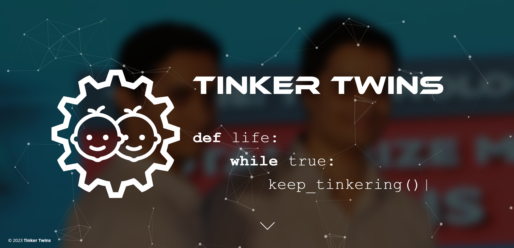

# Tinker Twins Website

:thinking: **Our real names:** Tanmay Vilas Samak & Chinmay Vilas Samak

:wink: **Fun fact:** We are identical twins

:slightly_smiling_face: **Ask us about:** Robotics and autonomous systems

<h1 align="left">The Brand:</h1>

 

**Tinker Twins:** [Chinmay Samak](https://www.linkedin.com/in/samakchinmay) and [Tanmay Samak](https://in.linkedin.com/in/samaktanmay) are twin brothers, who use "Tinker Twins" as a personal brand. The twins have come a long way tinkering with various tools and technologies, which has strengthened their scientific knowledge as well as technical and non-technical skills. The duo has worked on various projects ranging from microelectromechanical systems (MEMS) to in-orbit space settlements, and almost everything in between. They have a particularly keen interest in the field of robotics and autonomous systems, and are specializing in the field of autonomous vehicles.

 
<h1 align="left">The Twins:</h1>

 

**Tanmay Samak:** I received the [B.Tech. degree in Mechatronics Engineering](https://www.srmist.edu.in/program/b-tech-mechatronics-engineering/) with a silver medal from [SRM Institute of Science and Technology](https://www.srmist.edu.in/) in 2021. Having worked on several research projects in the field of autonomous vehicles, complemented with a solid background in mechatronics engineering, I have joined [ARMLab](http://cecas.clemson.edu/armlab-cuicar) at [CU-ICAR](https://cuicar.com/) as a direct Ph.D. candidate under the supervision of [Dr. Venkat Krovi](https://www.linkedin.com/in/venkatnkrovi) to pursue focused research in the field of vehicle automation. My research interests lie at the intersection of real and virtual worlds to create physically and graphically accurate digital twins. I am currently contributing towards projects such as [VIPR-GS](https://cecas.clemson.edu/VIPR-GS/), [OpenCAV](https://sites.google.com/view/opencav/), [AutoDRIVE](https://autodrive-ecosystem.github.io/) and [F1Tenth](https://f1tenth.org/).

 

**Chinmay Samak:** I received the [B.Tech. degree in Mechatronics Engineering](https://www.srmist.edu.in/program/b-tech-mechatronics-engineering/) with a gold medal from [SRM Institute of Science and Technology](https://www.srmist.edu.in/) in 2021. Having worked on several research projects in the field of autonomous vehicles, complemented with a solid background in mechatronics engineering, I have joined [ARMLab](http://cecas.clemson.edu/armlab-cuicar) at [CU-ICAR](https://cuicar.com/) as a direct Ph.D. candidate under the supervision of [Dr. Venkat Krovi](https://www.linkedin.com/in/venkatnkrovi) to pursue focused research in the field of vehicle automation. My research interests lie at the intersection of formal, data-driven and learning based methods to bridge the gap between simulation and reality. I am currently contributing towards projects such as [VIPR-GS](https://cecas.clemson.edu/VIPR-GS/), [OpenCAV](https://sites.google.com/view/opencav/), [AutoDRIVE](https://autodrive-ecosystem.github.io/) and [F1Tenth](https://f1tenth.org/).

 
<h1 align="left">Let's Connect:</h1>

  
  
  
  
  
  
  
  
  
  
  
  

